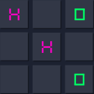

# RayTTT



<a href="./LICENSE"></a>
<a href="https://www.buymeacoffee.com/gabrielzschmitz" target="_blank"></a>
<a href="https://github.com/gabrielzschmitz/RayTTT"></a>

**RayTTT** is a classic TicTacToe game built in C++ using
[raylib](https://www.raylib.com/). It rocks a clean neon retro style with
bright colors and smooth animations that make the game fun and easy on the
eyes.

The gameplay is simple and intuitive -- perfect for a quick solo match or a
friendly challenge against a buddy. It keeps track of wins and draws so you can
see who's really winning the friendly rivalry.

It runs smoothly on Windows, Linux, and macOS, so no matter what system you’re
on, you’re good to go.

Plus, the code is neat and beginner-friendly, making it a great starting point
if you want to learn game dev with raylib and C++ or just tinker around.

---

## 🎮 Features

- Simple and intuitive gameplay  
- Neon retro visual style  
- Score tracking for players and draws  
- Responsive UI with smooth animations  
- Cross-platform support  

---

## 💻 Supported Platforms

- Windows  
- Linux  
- macOS  

---

## 🚀 Installation & Build

Detailed build and installation instructions for each platform are available in
the dedicated [INSTALL.md](INSTALL.md) guide.

---

## 🛠️ Quick Start

1. Clone the repository:

    ```sh
    git clone https://github.com/gabrielzschmitz/RayTTT.git
    cd RayTTT
    ```

2. Follow the steps in [INSTALL.md](INSTALL.md) for your platform to build and
   run the game.

---

## 🎨 Resources

The project includes a utility that automatically sets the working directory to
the resources folder, simplifying asset loading during development.

---

## ⚙️ Building for Different OpenGL Targets

You can specify the OpenGL version when building the project by modifying the
premake command or scripts. Supported targets include:

- OpenGL 1.1  
- OpenGL 2.1  
- OpenGL 3.3 (default)  
- OpenGL 4.3  
- OpenGLES 2.0  
- OpenGLES 3.0  

Refer to the [INSTALL.md](INSTALL.md) for command examples.

---

## 📄 License

This project is licensed under the MIT License. See the [LICENSE](LICENSE) file
for full details.
