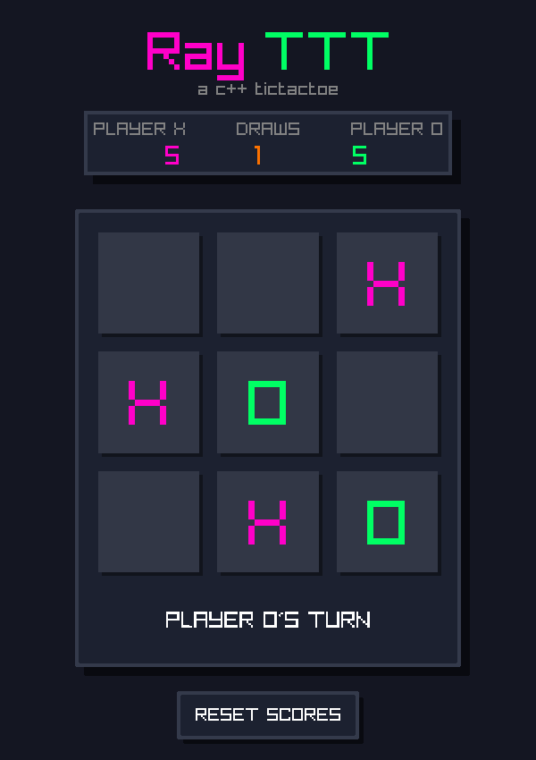
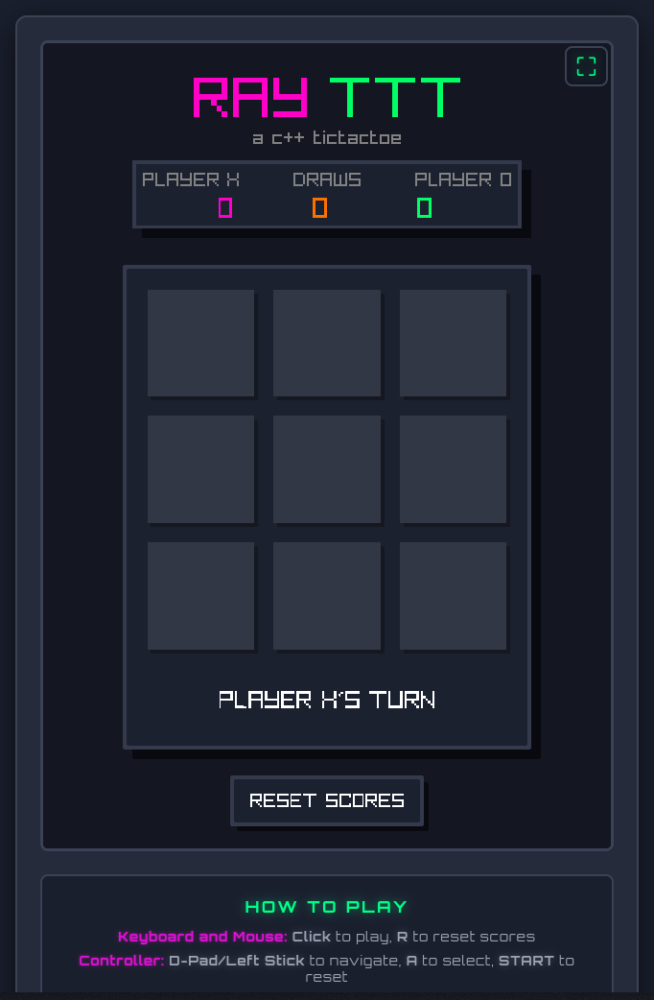

# RayTTT


<a href="./LICENSE"></a>
<a href="https://www.buymeacoffee.com/gabrielzschmitz" target="_blank"></a>
<a href="https://github.com/gabrielzschmitz/RayTTT"></a>

**RayTTT** is a classic TicTacToe game built in C++ using
[raylib](https://www.raylib.com/). It rocks a clean neon retro style with
bright colors and smooth animations that make the game fun and easy on the
eyes.

The gameplay is simple and intuitive -- perfect for a quick solo match or a
friendly challenge against a buddy. It keeps track of wins and draws so you can
see who's really winning the friendly rivalry.

It runs smoothly on Windows, Linux, macOS, and Web, so no matter what system you’re
on, you’re good to go.

Plus, the code is neat and beginner-friendly, making it a great starting point
if you want to learn game dev with raylib and C++ or just tinker around.


## Quick Start

1. Clone the repository:

```sh
git clone https://github.com/gabrielzschmitz/RayTTT.git
cd RayTTT
```

2. Follow the steps in [INSTALL.md](INSTALL.md) for your platform to build and
run the game.

## Demo

<p align="center">
    
    
</p>
<p align="center">
    <i>Desktop and Web version of the game in action</i>
</p>

## Itch.io Page

RayTTT also has its own **Itch.io page**, where you can try the browser version
instantly or download the desktop builds. The page includes a short
description, and an embedded web build so you can test the game with a single
click.

**Play now on Itch.io:**
[https://gabrielzschmitz.itch.io/rayttt](https://gabrielzschmitz.itch.io/rayttt)

## License

This project is licensed under the MIT License. See the [LICENSE](LICENSE) file
for full details.
